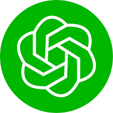

<h1 align="center">
    Hi  
    I'm <b>Senior Fullstack AI Engineer</b> 
    Welcome to <b>KingJupyter</b>

</h1>

 
    
    
    <!-- github -->
    

 

### ABOUT ME

- **Looking to work on position:** Senior AI developer
- **Interested in:** Data science, AI project(Prompt Engineering, Data Scraping, NLP, Computer Vision, Generative AI), Web project(MERN, Next, GraphQL, Web3, Webflow, Wordpress)
- **Hobby:** Boxing, Swimming

### TECHNOLOGY

<table align="center">
    <tr>
        <td align="center" width="96">
            
             Python
        </td>
        <td align="center" width="96">
            
             Jupyter
        </td>
        <td align="center" width="96">
            
             Numpy
        </td>
        <td align="center" width="96">
            
             Pandas
        </td>
        <td align="center" width="96">
            
             Scipy
        </td>
        <td align="center" width="96">
            
             Tensorflow
        </td>
        <td align="center" width="96">
            
             Pytorch
        </td>
        <td align="center" width="96">
            
             Scikit
        </td>
        <td align="center" width="96">
            
             OpenCV
        </td>
        <td align="center" width="96">
            
             LangChain
        </td>
        <td align="center" width="96">
            
             ChatGPT
        </td>
        <td align="center" width="96">
            
             Generative AI
        </td>
    </tr>
    <tr>
        <td align="center" width="96">
            
             LLM
        </td>
        <td align="center" width="96">
            
             NLP
        </td>
        <td align="center" width="96">
            
             Data Science
        </td>
        <td align="center" width="96">
            
             Beautiful Soup
        </td>
        <td align="center" width="96">
            
             Scrapy
        </td>
        <td align="center" width="96">
            
             Selenium
        </td>
        <td align="center" width="96">
            
             Django
        </td>
        <td align="center" width="96">
            
             Flask
        </td>
        <td align="center" width="96">
            
             FastAPI
        </td>
        <td align="center" width="96">
            
             Docker
        </td>
        <td align="center" width="96">
            
             JavaScript
        </td>
        <td align="center" width="96">
            
             TypeScript
        </td>
    </tr>
    <tr>
        <td align="center" width="96">
            
             MongoDB
        </td>
        <td align="center" width="96">
            
             Express
        </td>
        <td align="center" width="96">
            
             React
        </td>
        <td align="center" width="96">
            
             NodeJS
        </td>
        <td align="center" width="96">
            
             NextJS
        </td>
        <td align="center" width="96">
            
             Webpack
        </td>
        <td align="center" width="96">
            
             MySQL
        </td>
        <td align="center" width="96">
            
             AWS
        </td>
        <td align="center" width="96">
            
             Github
        </td>
        <td align="center" width="96">
            
             Git
        </td>
        <td align="center"  width="96">
            
             Laravel
        </td>
        <td align="center"  width="96">
            
             Rails
        </td>
    </tr>
    <tr>
        <td align="center"  width="96">
            
             HTML5
        </td>
        <td align="center"  width="96">
            
             Bootstrap
        </td>
        <td align="center" width="96">
            
             Tailwind
        </td>
        <td align="center" width="96">
            
             jQuery
        </td>
        <td align="center" width="96">
            
             Go
        </td>
        <td align="center" width="96">
            
             Ruby
        </td>
        </td>
        <td align="center" width="96">
            
             PHP
        </td>
        <td align="center" width="96">
            
             WordPress
        </td>
        <td align="center" width="96">
            
             Webflow
        </td>
        <td align="center" width="96">
            
             Sass
        </td>
        <td align="center" width="96">
            
             GraphQL
        </td>
        <td align="center" width="96">
            
             PostgreSQL
        </td>
    </tr>
</table>

<!-- activity graph heroku-app start -->

    

<!-- activity graph heroku-app end -->

### PROJECTS AND DEV STUFF
<b>⚡ Github Stats</b>
     
    

        
    

<b>☄️ Github Streaks</b>
  
   
  

### 🔝 Top Contributed Repo

   
<!-- My previous work -->

    <h2>Thanks for visiting </h2>

### TECHNOLOGY

<table align="center">
  <tr>
    <td align="center" width="96">
      
       Python
    </td>
    <td align="center" width="96">
        
       Jupyter
    </td>
    <td align="center" width="96">
        <a href="https://www.w3schools.com/python/numpy/default.asp">
            
             Numpy
        </a>
    </td>
    <td align="center" width="96">
        <a href="https://www.w3schools.com/python/pandas/default.asp">
            
             Pandas
        </a>
    </td>
    <td align="center" width="96">
        <a href="https://www.w3schools.com/python/scipy/index.php">
            
             Scipy
        </a>
    </td>
    <td align="center" width="96">
        
       Tensorflow
    </td>
    </td>
    <td align="center" width="96">
        
       Pytorch
    </td>
    <td align="center" width="96">
        
       Scikit
    </td>
    <td align="center" width="96">
        <a href="https://www.geeksforgeeks.org/computer-vision/">
            
             OpenCV
        </a>
    </td>
  <td align="center" width="96">
        <a href="https://python.langchain.com/v0.1/docs/additional_resources/tutorials/">
            
             LangChain
        </a>
    </td>
    <td align="center" width="96">
        <a href="https://www.w3schools.com/gen_ai/chatgpt-3-5/index.php">
            
             ChatGPT
        </a>
    </td>
    <td align="center" width="96">
        <a href="https://www.w3schools.com/gen_ai/index.php">
            
             Generative AI
        </a>
    </td>
    <td align="center" width="96">
        <a href="https://github.com/mlabonne/llm-course">
            
             LLM
        </a>
    </td>
    <td align="center" width="96">
        <a href="https://www.geeksforgeeks.org/natural-language-processing-nlp-tutorial/">
            
             NLP
        </a>
    </td>
    <td align="center" width="96">
        <a href="https://www.w3schools.com/datascience/default.asp">
            
             Data Science
        </a>
    </td>
    <td align="center" width="96">
        <a href="https://www.geeksforgeeks.org/implementing-web-scraping-python-beautiful-soup/">
            
             Beautiful Soup
        </a>
    </td>
    <td align="center" width="96">
        <a href="https://docs.scrapy.org/en/latest/intro/tutorial.html">
            
             Scrapy
        </a>
    </td>
    <td align="center" width="96">
        
       Selenium
    </td>
    <td align="center" width="96">
        
       Django
        <td align="center" width="96">
        <a href="https://www.geeksforgeeks.org/flask-tutorial/">
            
             Flask
        </a>
    </td>
    <td align="center" width="96">
        
       FastAPI
    </td>
    <td align="center" width="96">
        
       Docker
    </td>
  </tr>
  <tr>
    <td align="center" width="96">
        
       JavaScript
    </td>
    <td align="center" width="96">
        
       TypeScript
    </td>
    <td align="center" width="96">
        
       MongoDB
    </td>
    <td align="center" width="96">
        
       Express
    </td>
    <td align="center" width="96">
        
       React
    </td>
    <td align="center" width="96">
        
       NodeJS
    </td>
    <td align="center" width="96">
        
       NextJS
    </td>
    <td align="center" width="96">
        
       Webpack
    </td>
    <td align="center" width="96">
        
       MySQL
    </td>
  </tr>
  <tr>
    <td align="center" width="96">
        
       AWS
    </td>
    <td align="center" width="96">
        
       Github
    </td>
    <td align="center" width="96"> 
        
       Git
    </td>
    <td align="center"  width="96">
        
       Laravel
    </td>
    <td align="center"  width="96">
        
       Rails
    </td>
    <td align="center"  width="96">
        
       HTML5
    </td>
    <td align="center"  width="96">
        
       Bootstrap
    </td>
    <td align="center" width="96">
        
       Tailwind
    </td>
    <td align="center" width="96">
        
       jQuery
    </td>
  </tr>
 <tr>
      <td align="center" width="96">
        
       Go
    </td>
        <td align="center" width="96">
        
       Ruby
      </td>
      </td>
    <td align="center" width="96">
        
       PHP
    </td>
              <td align="center" width="96">
        
       WordPress
    </td>
              <td align="center" width="96">
        
       Webflow
    </td>
    <td align="center" width="96">
        
       Sass
    </td>
    </td>
    <td align="center" width="96">
        
       GraphQL
    </td>
    <td align="center" width="96">
        
       PostgreSQL
    </td>
 </tr>
</table>

<!-- activity graph heroku-app start -->

    

<!-- activity graph heroku-app end -->

### PROJECTS AND DEV STUFF
<b>⚡ Github Stats</b>
     
    

        
    

<b>☄️ Github Streaks</b>
  
   
  

### 🔝 Top Contributed Repo

   
<!-- My previous work -->

    <h2>Thanks for visiting </h2>

